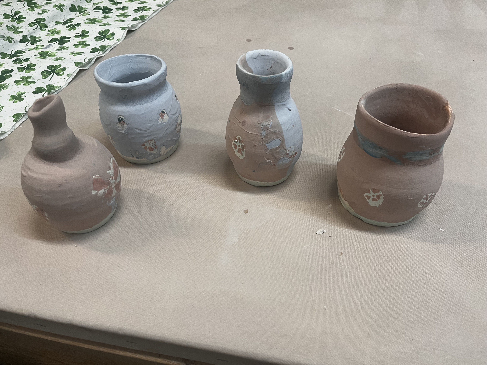
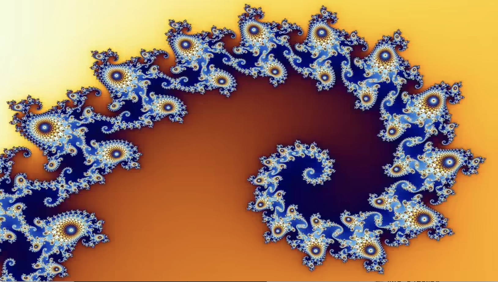
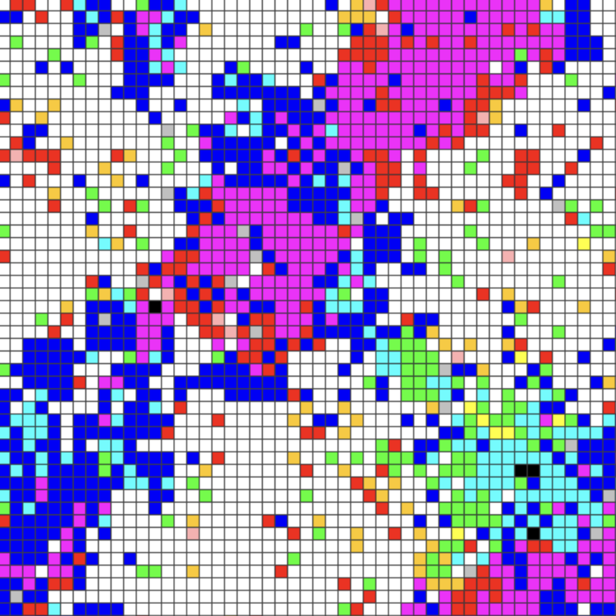

<!--temp.html
[My page](/temp.html)
-->
 

<h2>Pottery and Art exhibitions</h2>
Instagram link: <a href="https://www.instagram.com/sandcatstudio/">Studio Link</a>
  

    

<h2>Exploring Emergence Art for Graphics</h2>

Inspired by complexity research exploring Fractals, emergence, Sim's creatures and more showing up in my pieces

<h2>Knitting and Sewing Project Blogs</h2>
Ravelry link: <a href="https://www.ravelry.com/people/MariumKiran/">Ravelry Profile</a>

<!--temp.html
[My page](/temp.html)
-->
<!-- I love art! Inspired by architecture, places etc and usallu dabble in multiple mediums-->

<!--<h2>Other Activities</h2>
<ul>
  <li>Networks for Gaming</li>
  <li>Pets and Cat Resources</li>
  <li>Pottery</li>
  <li>Yoga Resources</li>
</ul>
-->
